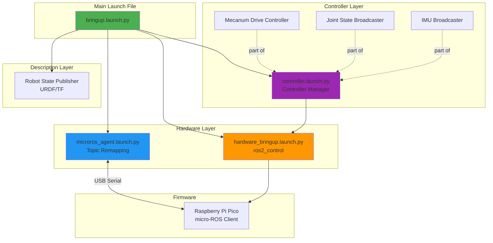
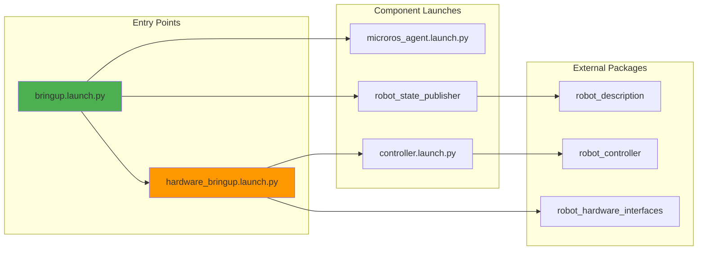
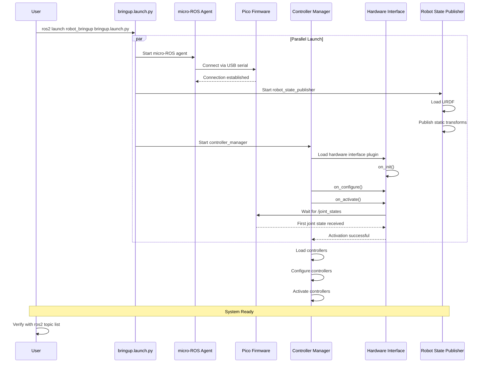
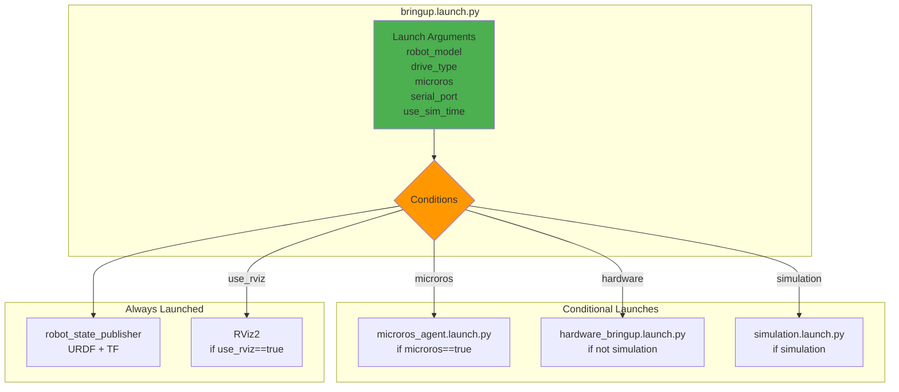
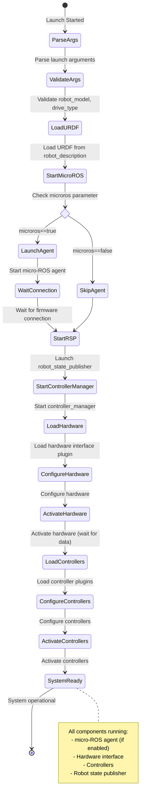
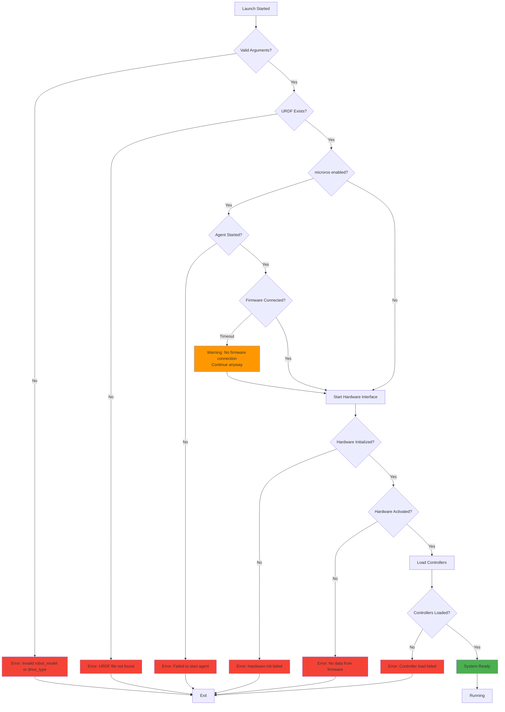

# robot_bringup Architecture

## Overview

This package orchestrates the launch of all robot components, including hardware interfaces, controllers, micro-ROS agent, and sensor nodes.

## Launch Architecture



## Launch File Hierarchy



## Sequence Diagram: System Startup



## Data Flow Diagram

```mermaid
flowchart TB
    subgraph "User Input"
        KB[Keyboard Teleop]
        JOY[Joystick]
        NAV[Nav2]
    end
    
    subgraph "Launch Configuration"
        BL[bringup.launch.py]
        PARAMS[Parameters<br/>robot_model<br/>drive_type<br/>microros<br/>serial_port]
    end
    
    subgraph "ROS2 Middleware"
        CV[/cmd_vel]
        JS[/joint_states]
        IMU[/imu/data_raw]
        ODOM[/odom]
    end
    
    subgraph "Hardware Layer"
        MRA[micro-ROS Agent<br/>Topic Remapping]
        HWI[Hardware Interface<br/>ros2_control]
    end
    
    subgraph "Firmware"
        PICO[Pico Firmware<br/>micro-ROS]
    end
    
    KB --> CV
    JOY --> CV
    NAV --> CV
    
    PARAMS --> BL
    BL --> MRA
    BL --> HWI
    
    CV --> HWI
    HWI --> MRA
    MRA <--> PICO
    
    PICO --> MRA
    MRA --> JS
    MRA --> IMU
    MRA --> ODOM
    
    JS --> HWI
    IMU --> HWI
```

## Component Interaction Diagram



## Launch Parameters

```mermaid
graph LR
    subgraph "Launch Arguments"
        RM[robot_model<br/>default: robot_xl]
        DT[drive_type<br/>default: mecanum]
        MR[microros<br/>default: true]
        SP[serial_port<br/>default: /dev/ttyACM0]
        SB[serial_baudrate<br/>default: 115200]
        UST[use_sim_time<br/>default: false]
        UR[use_rviz<br/>default: false]
    end
    
    subgraph "Derived Paths"
        URDF[URDF Path<br/>robot_description/urdf/robot.urdf.xacro]
        CTRL[Controller Config<br/>robot_controller/config/{model}/{drive}.yaml]
    end
    
    subgraph "Node Parameters"
        RSP_P[robot_state_publisher<br/>robot_description<br/>use_sim_time]
        CM_P[controller_manager<br/>controller_config<br/>use_sim_time]
        MRA_P[micro_ros_agent<br/>serial_port<br/>baudrate<br/>remappings]
    end
    
    RM --> URDF
    RM --> CTRL
    DT --> CTRL
    
    URDF --> RSP_P
    CTRL --> CM_P
    UST --> RSP_P
    UST --> CM_P
    
    MR --> MRA_P
    SP --> MRA_P
    SB --> MRA_P
```

## State Machine: Launch Process



## Topic Remapping Strategy

```mermaid
graph TB
    subgraph "Firmware Topics (with /rt/ prefix)"
        FJS[/rt/joint_states]
        FIMU[/rt/imu/data_raw]
        FODOM[/rt/odom]
        FSENS[/rt/sensors/*]
        FCMD[/rt/cmd_vel]
    end
    
    subgraph "micro-ROS Agent Remapping"
        direction TB
        R1[/rt/joint_states → /joint_states]
        R2[/rt/imu/data_raw → /imu/data_raw]
        R3[/rt/odom → /odom]
        R4[/rt/sensors/* → /sensors/*]
        R5[/cmd_vel → /rt/cmd_vel]
    end
    
    subgraph "Standard ROS2 Topics"
        JS[/joint_states]
        IMU[/imu/data_raw]
        ODOM[/odom]
        SENS[/sensors/*]
        CMD[/cmd_vel]
    end
    
    FJS --> R1 --> JS
    FIMU --> R2 --> IMU
    FODOM --> R3 --> ODOM
    FSENS --> R4 --> SENS
    CMD --> R5 --> FCMD
    
    style R1 fill:#2196F3
    style R2 fill:#2196F3
    style R3 fill:#2196F3
    style R4 fill:#2196F3
    style R5 fill:#2196F3
```

## Configuration Files

### bringup.launch.py

**Purpose**: Main entry point for launching the complete robot system

**Key Features**:
- Conditional launching based on parameters
- URDF loading and robot_state_publisher
- micro-ROS agent with topic remapping
- Hardware interface and controller manager
- RViz visualization (optional)

**Launch Arguments**:
| Argument | Type | Default | Description |
|----------|------|---------|-------------|
| `robot_model` | string | robot_xl | Robot model name |
| `drive_type` | string | mecanum | Drive type (mecanum/diff) |
| `microros` | bool | true | Enable micro-ROS agent |
| `serial_port` | string | /dev/ttyACM0 | Pico serial port |
| `serial_baudrate` | int | 115200 | Serial baud rate |
| `use_sim_time` | bool | false | Use simulation time |
| `use_rviz` | bool | false | Launch RViz |

### microros_agent.launch.py

**Purpose**: Launch micro-ROS agent with topic remapping

**Key Features**:
- Auto-detect Pico serial device
- Topic remapping (/rt/* ↔ /*)
- Configurable serial parameters
- Verbose logging option

**Topic Remappings**:
```python
remappings = [
    ('/rt/joint_states', '/joint_states'),
    ('/rt/imu/data_raw', '/imu/data_raw'),
    ('/rt/odom', '/odom'),
    ('/rt/sensors/range_tof', '/sensors/range_tof'),
    ('/rt/sensors/range_ultrasonic', '/sensors/range_ultrasonic'),
    ('/rt/sensors/illuminance', '/sensors/illuminance'),
    ('/cmd_vel', '/rt/cmd_vel'),
]
```

### hardware_bringup.launch.py

**Purpose**: Launch hardware interface and controllers

**Key Features**:
- Load ros2_control configuration
- Start controller manager
- Include controller.launch.py
- Hardware-specific parameters

## Error Handling



## Dependencies

- **robot_description**: URDF and robot model
- **robot_controller**: Controller configurations
- **robot_hardware_interfaces**: Hardware interface plugin
- **micro_ros_agent**: micro-ROS bridge
- **robot_state_publisher**: TF tree publishing
- **controller_manager**: ros2_control controller management

## Usage Examples

### Basic Launch
```bash
ros2 launch robot_bringup bringup.launch.py
```

### With RViz
```bash
ros2 launch robot_bringup bringup.launch.py use_rviz:=true
```

### Custom Serial Port
```bash
ros2 launch robot_bringup bringup.launch.py serial_port:=/dev/ttyUSB0
```

### Without micro-ROS (Simulation)
```bash
ros2 launch robot_bringup bringup.launch.py microros:=false use_sim_time:=true
```

### Differential Drive
```bash
ros2 launch robot_bringup bringup.launch.py drive_type:=diff
```

## Troubleshooting

| Issue | Possible Cause | Solution |
|-------|---------------|----------|
| Launch fails immediately | Invalid arguments | Check robot_model and drive_type |
| No firmware connection | Pico not connected | Check USB connection, verify /dev/ttyACM0 |
| Hardware activation fails | No data from firmware | Verify firmware is running, check micro-ROS agent |
| Controllers fail to load | Wrong configuration | Check controller config matches drive_type |
| No topics visible | micro-ROS agent not running | Verify agent started, check remappings |
